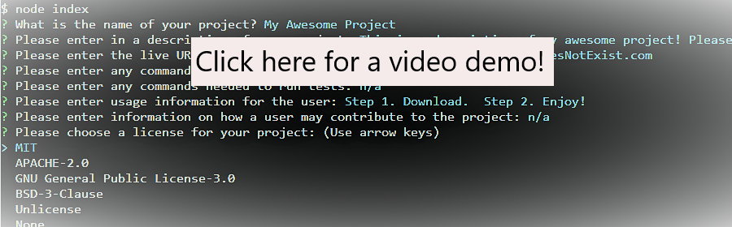

# Professional-README-Generator

***
<p align="center">
  
  
</p>

[](https://opensource.org/licenses/MIT)

Please click on the below screenshot for a video demo on using this application!
[](https://www.youtube.com/watch?v=4vBfjyvpR6g&feature=youtu.be&ab_channel=Christina2021)

##Table of Contents
* [Description](#description)
* [Installation](#installation)
* [Usage](#usage)
* [Questions](#questions)
* [License](#license)

<br>

## Description
Generate a README file with a standard template through the use of Node.js!  With this application, you will be given a series of questions regarding your project.  Once all have been answered, a README markdown file will generate that may be utilized as part of your project!
<br>

## Installation
Please see the following command needed in order to use this application:<br>
```bash
npm i
node index
```
<br>

## Usage
Please see the following instructions on how to use this application: <br>
⭐Download this directory and navigate into it within your terminal/command line.<br>
⭐This application will require Node.js.  Install Node if you do not already have it installed.<br>
⭐In the terminal, enter in the command "npm i" in order for the appropriate node packages to be utilized (this application uses the following package: inquirer).<br>
⭐In the terminal, enter in the command "node index" or "node index.js" in order for the application to run.<br>
⭐Answer the series of prompts presented.<br>
⭐A new README file will generate under the name "New-README.md".  You will be able to edit the name once it has been generated.
<br>

## Questions?
Feel free to check out my github profile [here](https://github.com/test)!
Should you have any questions, you may reach me by e-mail at: <a href="mailto:codechristina2021@gmail.com?subject=Hi,%20Christina!">codechristina2021@gmail.com</a>!.

## License
[MIT](https://choosealicense.com/licenses/mit/#)
